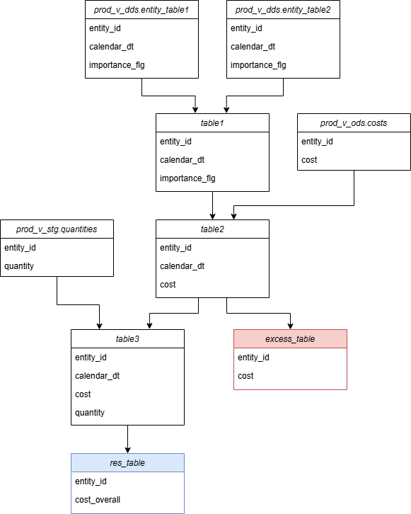
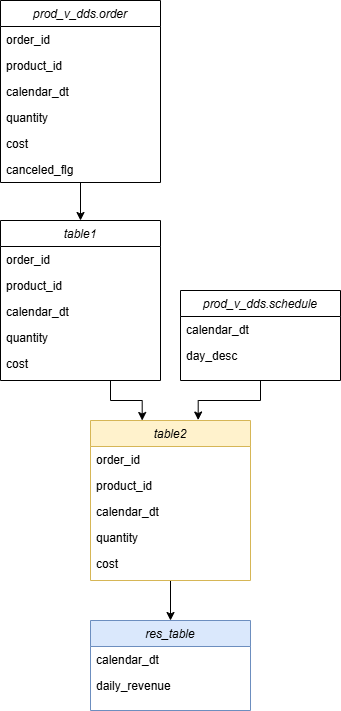
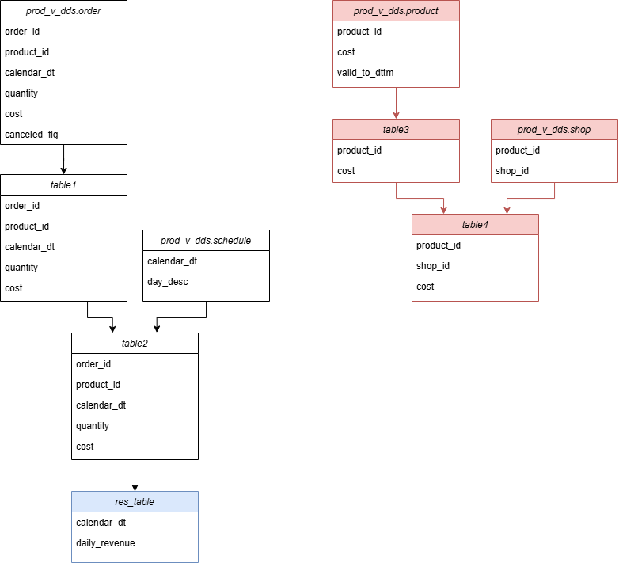
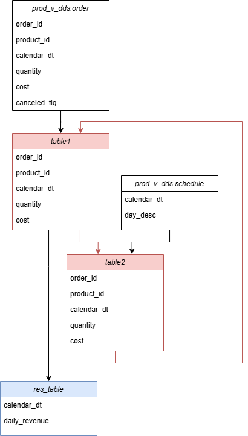

# Визуализация SQL-кода.

### Сценарии исполоьзования программы
Пользователь вводит SQL-код ETL-процесса и получает диаграмму, по которой можно понять следующие вещи:

* 

  
Неиспользуемая таблица - пользователь создал, но не использовал таблицу для построения результирующей.

  

* 

  
Не удаленная временная таблица - пользователь создал, но забыл удалить таблицу в ETL-процессе.

  

* 

  
Неиспользуемая ветка - аналогичная история, как в первом пункте, только несколько связанных друг с другом таблиц.

  

* 

  
Циклическая зависимость - возникает в случае создания нескольких таблиц с аналогичным названием.

  

